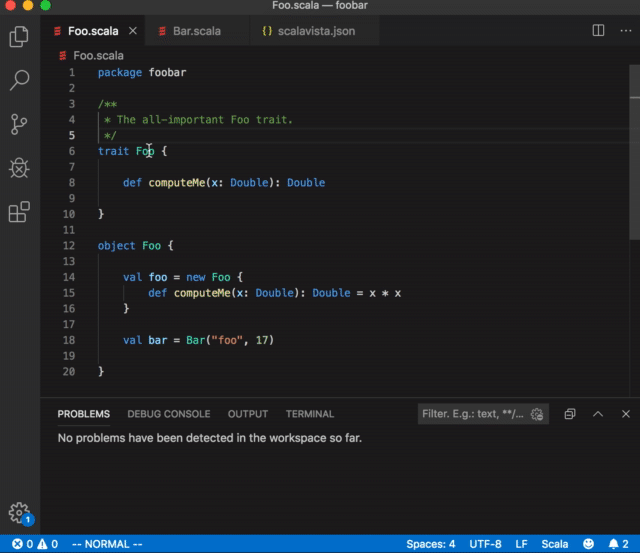

# vscode-scalavista

[](https://marketplace.visualstudio.com/items?itemName=buntec.vscode-scalavista)
[](https://github.com/buntec/vscode-scalavista)




The most lightweight, easy-to-use, yet feature-rich
VS Code extension for the Scala language:

* show type on hover;
* show fully qualified name on hover;
* show Scaladoc on hover;
* auto-completion;
* jump to definition (within the project);
* linting (compiler errors/warnings show up as you type).

Scala versions 2.11, 2.12, 2.13 are currently supported.
The extension is a front-end to the [scalavista-server](https://github.com/buntec/scalavista-server)
language server. It is very lightweight: no databases are created, no builds are imported.

## Prerequisites

Java (version 8 or greater): make sure you have `java` on your `PATH` or `JAVA_HOME` in your environment.

## Install 

Install this extension from the [Marketplace](https://marketplace.visualstudio.com/items?itemName=buntec.vscode-scalavista).

## Usage

Open the root of your project as a workspace.
The extension is activated upon opening any Scala source file (`*.scala`). 

On every activation the extension will query GitHub for the
latest [release](https://github.com/buntec/scalavista-server/releases)
of the [scalavista-server](https://github.com/buntec/scalavista-server)
jars.
If a more recent version is found, the user is asked to allow downloading.
Finally, the extension will launch a language server instance as a subprocess.
 This may take a few seconds (or longer if dependencies are
resolved for the first time).

If your project has external dependencies or you want to
pass flags to the Scala compiler, simply create
a `scalavista.json` file at the root of your project (workspace). 
Here is a basic example:

```json
{ 
    "scalaBinaryVersion": "2.12",
    "dependencies": [
        "io.circe:circe-core_2.12:0.11.1",
        "io.circe:circe-generic_2.12:0.11.1",
        "io.circe:circe-parser_2.12:0.11.1"
    ],
    "scalacOptions": [
        "-deprecation",
        "-feature",
        "-Ywarn-dead-code"
    ]
}
```

Have a look [here](https://github.com/buntec/scalavista-server) for more details.

If you enjoy using this extension, please star this project on GitHub or leave a good rating on the Marketplace. Thank you!