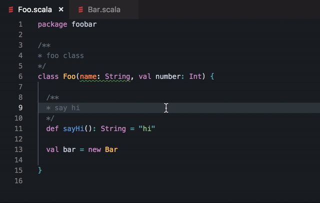

# vscode-scalavista

A Visual Studio Code extension that provides IDE-like functionality
for the Scala language (2.11-2.13):

* show type on hover;
* show Scaladoc on hover;
* auto-completion;
* jump to definition (within the project);
* linting (compiler errors/warnings show up as you type).

The extension is a front-end to the [scalavista-server](https://github.com/buntec/scalavista-server)
language server, which in turn is a wrapper around Scala's presentation compiler.

## Prerequisites

* Java (version 8 or greater): make sure you have `java` on your `PATH` or `JAVA_HOME` in your environment. Java is needed to launch the language server.
* The [official Scala syntax extension](https://marketplace.visualstudio.com/items?itemName=scala-lang.scala) is highly recommended. This extension does not provide syntax highlighting!
* [sbt](https://www.scala-sbt.org) and the [sbt-scalavista](https://github.com/buntec/sbt-scalavista) plugin are recommended but not required. 

## Install 

Install this extension from the [Marketplace](https://marketplace.visualstudio.com/items?itemName=buntec.vscode-scalavista).

## Usage

The extension is activated upon opening any Scala source
file (`*.scala`). On activation it will compare your local
version of the [scalavista-server](https://github.com/buntec/scalavista-server) jar (if any) to the latest
[release on GitHub](https://github.com/buntec/scalavista-server/releases). 
If a more recent version is found, the user is prompted to allow automatic downloading.
Finally, the extension will launch a language server
instance as a subprocess, which may take a few seconds. 
Once the server is running the extension becomes fully functional.

To get the most out of this extension, especially for larger
projects or those with external dependencies, a `scalavista.json`
file should be created at the root of your project (workspace). 
Have a look [here](https://github.com/buntec/scalavista-server) for details.
If you are using sbt, then the [sbt-scalavista](https://github.com/buntec/sbt-scalavista)
 plugin can generate this file for you.